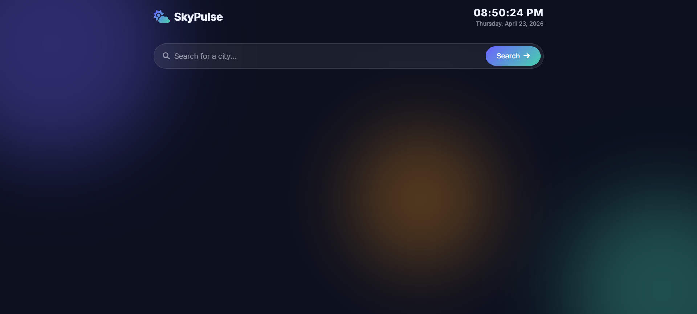

# 🌦️ Weather Dashboard

A modern and responsive **Weather Dashboard** that provides real-time weather updates, 5-day forecasts, and hourly predictions using live API data. Built with a clean UI and smooth animations, this project demonstrates strong front-end development and API integration skills.

---

## 🚀 Features

* 🔍 Search weather by city name
* 🌡️ Real-time temperature, condition, and location data
* 📅 5-Day weather forecast
* ⏰ Hourly weather updates
* 🌅 Sunrise & Sunset timings
* 💧 Humidity, Wind Speed, Visibility, Pressure, UV Index
* 🎨 Dynamic UI based on weather conditions
* 🕒 Live clock and date display
* ⚡ Fast and responsive design

---

## 🛠️ Tech Stack

* **HTML5** – Structure
* **CSS3** – Styling & animations
* **JavaScript (Vanilla JS)** – Logic & API handling
* **WeatherAPI** – Real-time weather data

---

## 📂 Project Structure

```
weather-dashboard/
│── index.html
│── style.css
│── app.js
```

---

## 🔑 API Used

* Weather data fetched from **WeatherAPI**

> Note: API key is required to run this project. You can get a free key from https://www.weatherapi.com/

---

## ⚙️ How to Run Locally

1. Clone the repository

```
git clone https://github.com/your-username/weather-dashboard.git
```

2. Navigate to the project folder

```
cd weather-dashboard
```

3. Open `index.html` in your browser

---

## 🌐 Live Demo

[👉 Add your deployed link here (GitHub Page)](https://amanmohanty18.github.io/skypulse-weather-dashboard)

---

## 📸 Screenshots



---

## 💡 Future Improvements

* 🌍 Auto-detect user location
* 📱 Better mobile responsiveness
* 🌙 Dark/Light mode toggle
* ⭐ Save favorite cities

---

## 📜 License

This project is licensed under the MIT License.

---

## 👨‍💻 Author

Developed by **Aman Mohanty**

---

## ⭐ Show Your Support

If you like this project, please ⭐ star the repository and share it!

---
